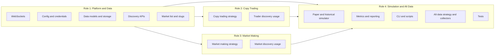

# Team Delegation: Four Roles and Role Guides 

## Role breakdown

---

## Deliverable: four markdown guides

Create a **`docs/`** directory and add four role-specific guides. Each guide is a single markdown file that one person can own. Guides are written for a **quant club** audience: they emphasize quantitative skills, metrics, and research-style tasks.

| File | Role | Quant focus |
|------|------|-------------|
| docs/ROLE_1_PLATFORM_AND_DATA.md | Platform & Data Lead | Data pipelines, API reliability, and clean inputs for alpha/simulation. Skills: data engineering, validation, time-series-ready schemas. |
| docs/ROLE_2_COPY_TRADING.md | Copy Trading Lead | Alpha from trader selection (scoring, filtering) and execution (sizing, timing). Skills: signal design, performance attribution, position sizing, statistical filtering. |
| docs/ROLE_3_MARKET_MAKING.md | Market Making Lead | Alpha from spread capture and inventory management. Skills: market microstructure, fair-value estimation, inventory risk, PnL decomposition. |
| docs/ROLE_4_SIMULATION_AND_ALT_DATA.md | Simulation & Alt Data Lead | Rigorous backtesting and alt-data alpha. Skills: backtest design, metrics (Sharpe, drawdown, IC), ML/sentiment for fair value, hypothesis testing. |

---

## Structure of each guide (template)

Each of the four docs follows this structure so owners know what to read and which quantitative skills they will use.

1. **Role and mission** (2–3 sentences)
   - What this role owns and the goal (e.g. "make copy trading profitable").
2. **Quantitative skills you will use**: List required/used skills and what you will develop (see **Quant skills** in each role summary below).
3. **What exists**
   - **Files you own**: List of paths (e.g. `src/websockets/kalshi.py`, `src/discovery/trader_discovery.py`).
   - **Key behavior**: Short description of what the code does today (entry points, APIs used, how it's called).
   - **Config and env**: Relevant `.env` / src/config/settings.py and src/config/credentials.py variables.
4. **What needs to be done**
   - **Bugs / correctness**: Known issues (e.g. leaderboard response shape, Kalshi base URL, discovery returning 0).
   - **Gaps for profitability**: Concrete next steps (e.g. "add debug for Polymarket leaderboard", "validate Kalshi GET /markets", "improve trader filter", "add market mapping for copy trading").
5. **How to run and test**
   - Commands to run (e.g. `python scripts/discover_traders.py`, `python scripts/run_strategy.py --strategy copy_trading --mode paper --duration 1`).
   - How to verify your area (e.g. "see traders in logs", "see markets subscribed").
6. **Dependencies on other roles**
   - What you consume from others (e.g. "WebSocket events from Role 1", "simulator run loop from Role 4") and what you provide (e.g. "discovery functions used by Role 2 and 3").

---

## Content summary by role

### Role 1: Platform & Data Lead

- **Quant skills**: Data engineering; time-series-ready schemas; API and response validation; ensuring clean, consistent inputs for alpha and backtesting.
- **Owns**: src/websockets/ (base, kalshi, polymarket), src/config/ (settings, credentials), src/data/ (models, storage, collectors), src/discovery/ (trader_discovery, market_discovery, _http), src/simulator/market_list.py.
- **Exists**: WebSocket clients with auth (Kalshi PEM, Polymarket market channel), SSL via certifi; data models (Order, Trade, Position, OrderBook, etc.) and SQLite storage; Polymarket Data API leaderboard and Gamma events, Kalshi GET /markets; slug resolution for test_markets.
- **To do**: Add optional debug for leaderboard/markets responses; confirm Polymarket response shape; align Kalshi base URL with docs; ensure discovery returns data; document env. Quant: define and document data quality checks and time-series invariants for downstream strategies.

### Role 2: Copy Trading Lead

- **Quant skills**: Signal design and backtesting; trader quality scoring (PnL/vol, win rate, min sample size); performance attribution; position sizing and risk limits; statistical filtering (e.g. time decay, significance).
- **Owns**: src/strategies/copy_trading.py; use of trader discovery (owns how the strategy uses it).
- **Exists**: Strategy calls `get_trader_ids_meeting_spec()` for `tracked_traders`; on trade events, builds `trader_trades`, computes `TraderPerformance`, generates copy signals for top traders (win_rate ≥ 0.5); optional cross-platform mapping via `market_mapping` (currently not populated).
- **To do**: Ensure discovery fills `tracked_traders` (with Role 1); populate or remove `market_mapping`. Quant: define and backtest a trader quality score (e.g. PnL/vol, Sharpe proxy, min trades); add position sizing (e.g. Kelly fraction or fixed risk per trade); validate in paper and report Sharpe, drawdown, profit factor.

### Role 3: Market Making Lead

- **Quant skills**: Market microstructure; fair-value estimation (mid, microprice, or model-based); spread and liquidity filters; inventory risk and skew (quote adjustment); PnL decomposition (spread capture vs inventory PnL).
- **Owns**: src/strategies/market_making.py; use of market discovery.
- **Exists**: Strategy calls `discover_markets_for_making()`, exposes `get_discovered_market_ids()`; on orderbook updates, computes fair value (weighted mid), checks `_is_market_suitable` (spread vs `max_spread`), generates limit bid/ask signals (1% quote spread).
- **To do**: Ensure discovery returns markets (with Role 1). Quant: calibrate discovery thresholds (spread, liquidity) using historical or paper data; improve fair value (e.g. microprice, confidence intervals); add inventory limits and skew; decompose and report PnL (spread vs inventory); validate in paper with Sharpe, drawdown, profit factor.

### Role 4: Simulation & Alt Data Lead

- **Owns**: src/simulator/ (base, paper_trading, historical, metrics), scripts/ (run_strategy, discover_traders, discover_markets, resolve_polymarket_slugs, collect_historical), tests/, src/strategies/alt_data.py, src/data/collectors.py (Twitter and any future collectors).
- **Exists**: Paper simulator starts WebSockets, starts strategies, merges CLI/file markets with strategy-discovered markets, subscribes, runs loop and duration; historical replays events from JSON; metrics and report; alt-data strategy uses TwitterCollector (if bearer token set), builds simple linear fair-value model from sentiment/mentions/engagement, generates signals from model vs market price; pytest for strategies and simulator.
- **Quant skills**: Backtest design and bias avoidance; performance metrics (Sharpe, max drawdown, profit factor, IC); hypothesis testing; ML/sentiment for fair value; alt-data feature engineering and model backtesting.
- **To do**: Add optional verbose/debug; align historical replay and collection script. Quant: ensure backtest metrics are correct and documented; add IC for alt-data signal quality; alt-data keyword-to-market mapping and fair-value model backtest (in-sample/out-of-sample); expand tests; document run_strategy and scripts.

---

## Implementation steps

1. **Create `docs/`** in the repo root (if it does not exist).
2. **Add docs/ROLE_1_PLATFORM_AND_DATA.md** using the template above and the Role 1 content summary (files, behavior, config, to-do, run/test, dependencies).
3. **Add docs/ROLE_2_COPY_TRADING.md** for the Copy Trading Lead (same template, Role 2 content).
4. **Add docs/ROLE_3_MARKET_MAKING.md** for the Market Making Lead (same template, Role 3 content).
5. **Add docs/ROLE_4_SIMULATION_AND_ALT_DATA.md** for the Simulation & Alt Data Lead (same template, Role 4 content).
6. **Add a short docs/README.md** that lists the four roles, points to each guide, and states that guides are quant-focused with explicit quantitative skills per role; each person reads their own guide first and checks "Dependencies on other roles" for handoffs.

No code or config changes are required beyond adding these markdown files. Existing docs (GUIDES.md, setup.md, .env.example) stay as-is; the role guides can reference them where useful.
